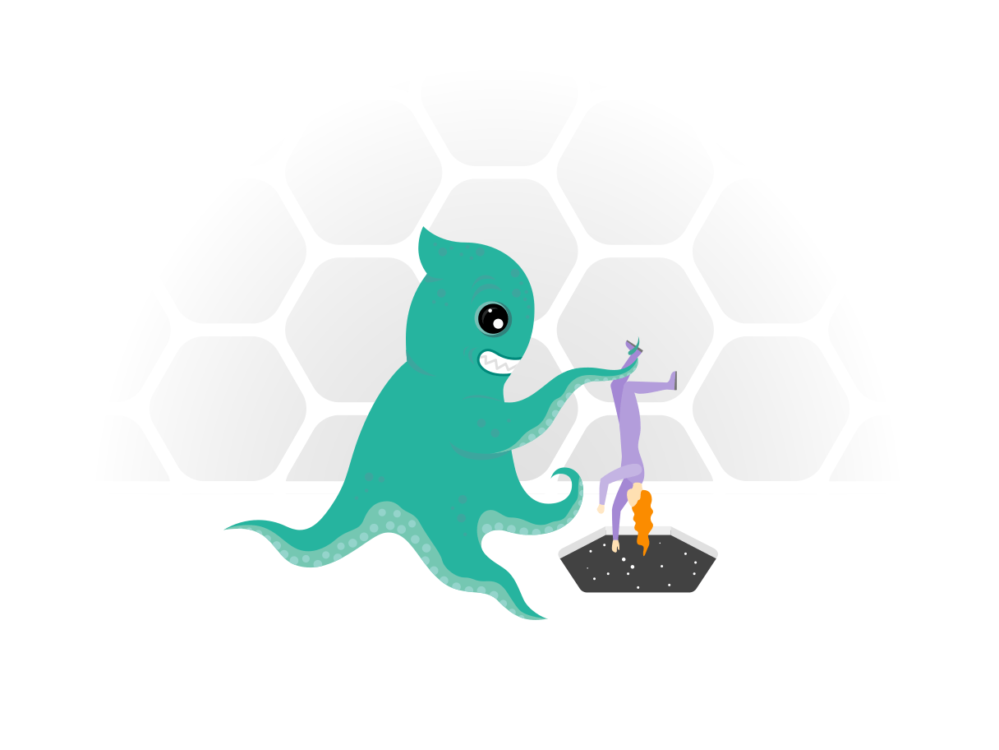

## 1. Create a story:

It’s all about a great story.

> What unites people? Armies? Gold? Flags?
>
> -- Stories. There’s nothing more powerful in the world than a good story. Nothing can stop it. No enemy can defeat it.

A great story touches people’s core, generate trust, sympathy, connection with positive emotions. Nike always has some storytellers. “As Nike gets even bigger, its storytellers feel that their mission becomes even more critical,” according to a Fast Company on the Nike storytelling culture. At Nike, the heroics of the past inspire the innovations of the future. “The best way for a company to create a prosperous future is to make sure all of its employees understand the company’s past. That’s why many veteran execs at Nike spend time telling corporate campfire stories.”

<!-- [card](https://www.fastcompany.com/38979/nike-story-just-tell-it) -->

Be creative in creating a beautiful story by putting some screenshots of the platform, videos about the team, videos of the testimonials, videos of the product, videos from users about their experience. These things build emotional touch with visitors.

## 2. Put clients logos, testimonials, awards or featured in:

Who are your clients? Are they well-known companies? then you must mention them. Here, you’re providing social proof of your product that these companies are already using your product. Many people use many products, just because some company whom you admire is using it.

Testimonials are a great way to show what your users feel about your product. How it is helping them, how it’s solving their problem, how it’s making their life easier. It also comes under “Social proof”. Try to give some background about the person whose testimonial you’re putting on the site, is he from [Uber Design](https://brand.uber.com/), [Facebook Design](https://design.facebook.com/) or [Google Design](https://design.google/) 😉. More then half of the apps people use are because someone they follow recommended them on social media or somewhere.

If your product is being featured in any newspaper or in any well-known site or blog or in some media, do mention it. People follow authority, people follow experts. If your product was featured in TechCrunch, InVision or in any blog, newsletter, do mention it.

Awards give your product, credibility, do mention them. Awards are a great way to show people, that you are the best at what you’re doing.

## 3. Show the people who are working behind the scene:

It shows the authenticity of the product. Show that there are real teams working behind the product. Show that, “we’re not someone who made some fake site and just after money.” Show the team, show the people.

Yes I know, there are many sites who do not show any people on their sites. And yes, you are right. Those companies are either already successful or they have their strong social presence.

## 4. Walk the talk:

The first rule of any product site is: never lie to a user. Lying is a big trust breaker, not just in the virtual world but also in the real world.

Show and mention features which are part of your product. If you showing ✨ features on the site, then you must have those features in the app. Don’t write lies to earn some short term money. If you want to be in the long run, first win user’s trust.

## 5. Provide 360º customer support:

Customer support shows that you are not here just to earn money. You’re here to solve a problem and whatever it takes to solve it. You are here to support the product and solve the queries. There are many ways you can provide support. Some are:

1. Support page
2. Support bot
3. Chat
4. Feedback
5. Support contact (if possible)
6. Support email

Choose which are best suitable for your organization. You can use Intercom or Freshdesk for all the above.

## 6. Use authentic images (Big no to bad stock pics):

You might argue, everyone uses it. Yes, I know. But think about it. In one page, you are showing real images of your users, of your product and telling about their experience, creating a story.

And now, think about the second page, where you are showing fake stock pics, fake smiles, and fake experiences. And now think, which one of these pages makes a great impact on people’s mind? Think wisely!

## 7. Humanize the content and site:

If you can make it right, half of the visitor can easily turn into users. It’s all about content. Focus on quality here, not quantity. Be precise and to the point.

Think, how you read other product sites and where you focus more, do you read everything or do you just skim through the headings and images? Think about it and focus on those. Keep the words and sentences to the minimum.

## 8. Do 360º marketing of the product:

Build trust through social media, engagement with people, helping them. Not just sell the product, sell your brand, sell your team, sell yourself through marketing, through your blogs.

> Show it: “That you know it. That’s why you are into it.”

Think about the best companies. Think of InVision, think of Flipkart, think of Medium or any other companies you admire. Go through their site, their blogs. You’ll get to know more about the company, about their team, about the people behind. Companies like these, always publish everything about what they are learning, what they are solving. That shows, that they know what they are doing. Just remember, if your organization is not able to make it tomorrow, your team will.

## 9. Have integrations? mentions them:

I’m sure, you know about integrations. If not: [read here](https://en.wikipedia.org/wiki/Integrated_software).

This is one of those things which sometimes makes the user switch to other products. Your users want ease. Think of Jira from Atlassian, think of Slack or any other product you use on a daily basis, which has integrations with other products. The more integration it has, the easier it is for the users. Learn more about the users, try to integrate your products with the products which your users use on a daily basis. Integrations somehow put you in the league of the products you’re integrating with.

### Small ones, big impact ones:

- How compelling call to actions is?
- Loading time
- Mobile version, responsiveness
- All links should be working
- Must be https
- Use of Cookies banner, if using any

🙏
