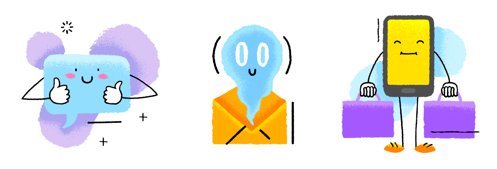
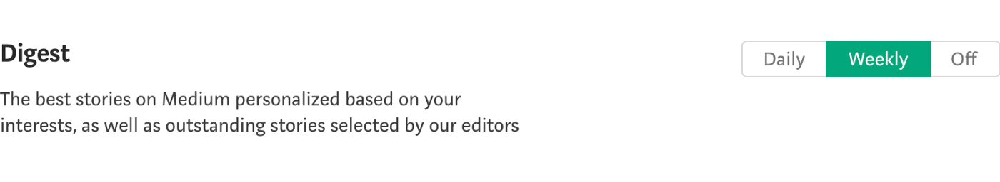
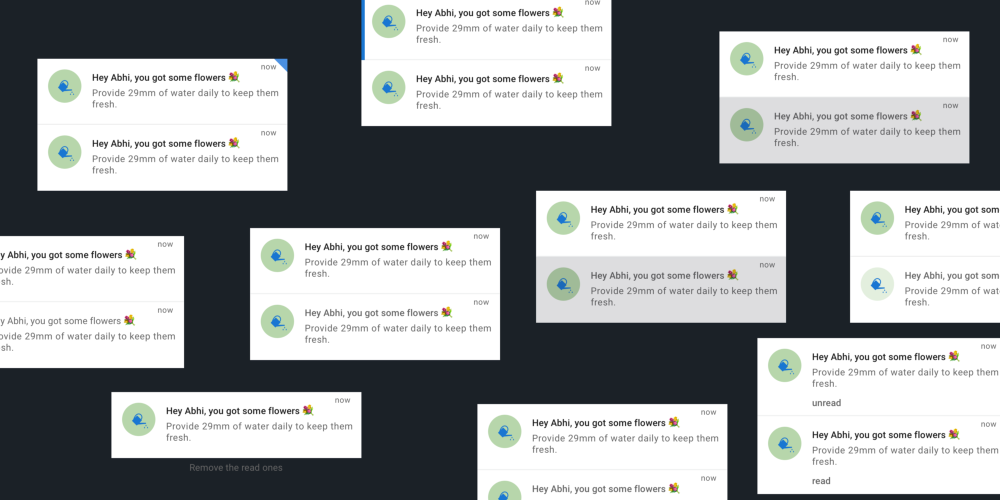
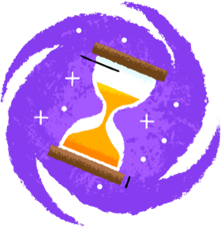
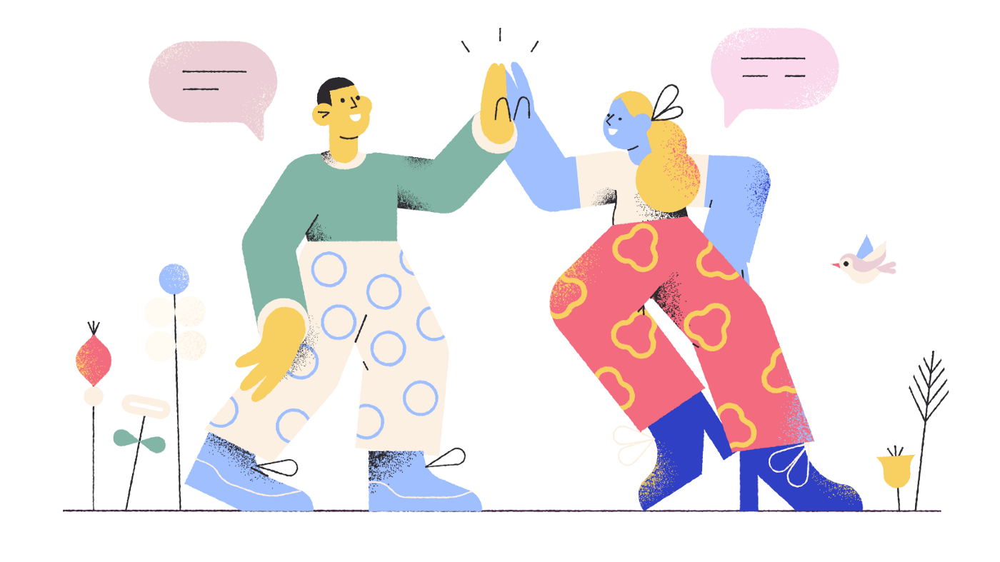

## Why not just Start with WHY?

As a child, I always am the first one to run to pick the retro phone whenever it rings. And, now behavior continuing with the notifications. Notifications are being used to notify users about the alert, statuses, updates whether an app is running or not. Assuming everyone reading this article have used notifications once in their lifetime. So, I’m directly jumping to the points 🎯 instead of going into tidbits about notifications.

> In laymen, notifications are just like a personal assistant who remind us of tasks and keep us updated with the important stuff on day to day basis.

**Ideally, notifications should:** 
👍 Be easy to use 
🔍 Have attention to detail 
👨‍💼 Be expertly curated 
💖 Be personalized 

## 1. Ping when its absolutely essential:

Notifications are designed to notify the users about important updates. And, thus grabs users-attention by some sound. **Pinngggdgggggggg…**.. And, If you ping when it's not important, you’ll just end up with frustrated users. You can give users a choice of what notifications they want. If you have many updates to send, think of giving a user a choice of daily, weekly or monthly for some notifications.

Or for some notifications, you don't even have to ping, just update the badge count on the app icon(Badge counts are only supported in iOS). Badge count’s right implementation is one of those things I liked about WhatsApp. When you mute someone or some group. WhatsApp doesn’t send you the notifications for those blocked users/groups but it updates the badge count on the app icon.

> **Key takeaway:** Only ping when its absolutely essential. User should believe, if your app is pinging, then there must be something damn important. Build some trust. Keep the notifications **1–2 per day** and no more than **5–6 per week**\*

## 2. Personalized voice and tone:

In a party, when you can’t able to listen to the next person but someone from a galaxy far far away takes your name, you’ll suddenly look towards him, don’t you? Personalization is the **secret sauce** which many companies don’t use. Think through users persona’s perspective, does the user wants notifications in the more professional, more cheesy or somewhere in middle tone? I prefer a bit enjoyable and bit professional, always go for the **perfect balance**.

Don’t use google translated sentences for other languages. Put some personalization there too. If you don’t have someone in the office for targeted language, a google search will give you some hand-full of agencies to do a job for you.

> **Key takeaway**: Personalization is the key 🔑. Take inspiration from real world. Personalisation’s result will surprise you with some lifetime users.

## 3. Differentiate read and unread notifications:

Most apps use a background color to differentiate between the read and unread notifications. There are many different ways of differentiating, take user personas in consideration and think about, where your users spend most of their time, it outdoors or indoors, in sunlight or in shadow, think through the lens of color-blindness too. Some of the ways are:

- Background color
- Text color and weight
- Some chip around the corner
- Faded read notifications
- Some apps delete the read ones and only keep unread notifications(depends upon your app’s use-case)
- By small text around the corner or bottom of the single notification cell that says ‘read’ or ‘unread’
- There can be many more, think and find out what suits your app better.

> **Key takeaway:** It’s good practice to show differentiation between the read and unread state. But do not only depend on background color or pattern of some other apps. Think through your user’s perspective. Empathize!

👉 I use an app called [Stark](https://getstark.co/) for an accessibility check.

## 4. Timing of the notifications:

At what time which notification to which user type will be best suitable. For example, you might have seen, most of the birthday notification from Facebook comes in the morning at around 9. For meditation apps, they come in the morning or in the night before sleeping time. Slack is one those apps I love for their notification’s timing pattern, they do not send the notifications before and after office-time and you can adjust office time in the notification setting. Also, think of the users country’s time, they have different sleeping time, try not to disturb users when they are sleeping. Though nowadays phones have ‘Do not disturb’ mode. But, I bet some users don’t know about that and some don’t use that.

> **Key takeaway**: Different type of users needs the different type of notifications at different times.

## 5. Notification center in the app:

There should be a place in the app where users can go and see all the notifications received. Notification center should be placed somewhere, where it can easily be accessible. Do not put it somewhere deep down in the app, if you do that then users might not be able to know that an alerts/updates are available. And think about, do your user really need the notification center or not? Mostly all social media have a notification center. Instant messaging do not have one but they treat the main chats list area as a notification center by showing some badges and read/unread state. Best examples are WhatsApp and Facebook messenger and slack 🙌. Apps like Phone(iOS), App Store use the pre-existing tabs to signify the updates and show badge on the respective tab. Apps like HeadSpace, Spotify, health apps do not need notifications center but they do send notifications.

Use badges, badges are a great way to signify updates. Think of all the use-cases, when the badge will disappear, will it update according to read/unread state or will disappear once the notification canter is opened.

> **Key takeaway**: Research about notification center, does your users need it or not. If yes, then place it in someplace where it can be easily accessible and use badges.

## 6. Notification actions:

A notification must have a primary action. When the user clicks a notification, then it should perform something or take the user the place where he can find the Iron Throne 👑. Notification’s title and description should be crisp, clear, concise and easily be able to convey the primary action of the notification.

Sometimes, some notifications need secondary actions, like \`reply\` or anything according to the app. Think over it because you might end up helping users to achieve the end goal asap. Only give secondary action when it's absolutely essential.

> **Key takeaway**: Give primary action on notification, Think of secondary actions where needed.

## 7. Metrics 📈:

Very very important for you as a developer, designer, manager or as a company. If you don’t have any metric system on place, this should be the first task you should be picking/pushing in the next sprint/cycle.

> If you can't measure it, you can’t improve it.

If you have metrics system in place then measure everything possible about the notifications. How many sent vs delivered vs opened vs able to perform the end goals.

> **Key takeaway:** Analyze everything before and after notifications fixes. Design, test, measure, and iterate. That’s how you can improve the notifications or anything in the app.

## 8. Notifications life-line 👻:

Some notification loses its value after a certain time, vanish them up. Some notifications, don’t even have to be in the notification center, they just come and do their job. Notifications like: _App update notification, sleep time from an alarm app, etc._

You can also give the flexibility to delete notifications. Though the notifications should be totally flexible and the user should have permission to clear, delete or mark all as read. But depending on the app’s use case.

> **Key takeaway:** Delete the notification which loses the value to the user. If your app’s use-case provides the flexibility to delete the notification. do that. ✌️

## 9. Notifications according to the personas 🤥:

**Personas** can help you in many unimaginable ways, language to use, important notification to send at what time. Personas can help you with different notification for different users. Like admins and the normal user might have a different type of notification. Admin mostly likes analytics notifications. Think about it, it was just an example.

> **Key takeaway:** To provide the best experience to the user, you need to know the user first. Why not start with making personas.

## 10. Show the date and time of every notification:

Sometimes, the user needs to see the time and date both of the notification. Sometimes, the user doesn’t even care about the time only cares about the date and sometimes even cares about the seconds. There can be some crucial use-cases about it. So, think of it very carefully. You can show these at the top of the notification or at the bottom of each notification. Use-case might differ between personas too, think of it acc. to your users. Find the best, give the best, get feedback and iterate.

> **Key takeaways:** Sometimes, users care about the exact time, sometimes do not. Give date and time of each notification in one way or other.

> **Note:** This is just a checklist, it might change according to your use-cases.

<video autoplay loop>
    <source src="./mobile.mp4" type="video/mp4" />
</video>

### Extras to ponder upon:

- Take full advantage of the badge on the app icon
- Pull to refresh
- Reminder notifications
- Achievement notifications
- Location-triggered notifications
- Notification settings area
- Don’t be afraid to use emojis 😉 but don’t overdo it. The best way is to find out have max one emoji in a visible screen. 👻You😆 🤣can’t🤥🧐 read 🤨something🤩 ✌️like this🙌 easily.

If notifications have done well, they have the potential to make some loyal lifetime users.

### BONUS: Notification center icon in the app:

Most of the apps use the bell 🔔 icon for the notification center. If your app was using the bell icon for a different purpose, then think how you can easily convey the new behavior of the bell icon. You can change both icons for some months and then set the bell icon for notification after some months.

### Recommended articles to read:

- [New data shows up to 60% of users opt-out of push notifications](https://andrewchen.co/why-people-are-turning-off-push/)
- [Pull, Don’t Push: 5 Steps for Personalized App Marketing](https://www.apptentive.com/blog/2015/10/20/pull-dont-push-personalized-app-marketing/)
- [Opportunities and Challenges for Smartphone Applications.](https://www.ncbi.nlm.nih.gov/pmc/articles/PMC3636318/) and search for 'notification'
- [How to design behavior](https://www.nirandfar.com/how-to-design-behavior/)
- [The Psychology of Notifications: How to Send Triggers that Work](https://www.nirandfar.com/notifications-that-work/)

\*This can be changed according to the use-case of your app. Apps like messenger, WhatsApp lies in this category.
