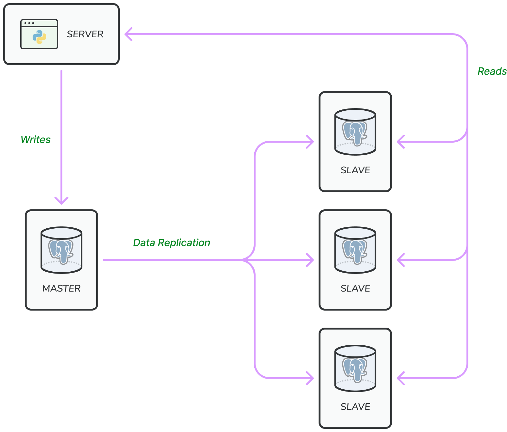

**According to Wikipedia:** Database replication can be used in many database management systems. Usually with a
master/slave relationship between the original(master) and the copies(slaves).

- The master only supports write operation.
- The slave database gets copies of the data from the master and only supports read operation.

All the database modifying commands must be sent to the master database.

The most application requires a much higher ratio of reads than writes. Thus, the number of slave databases in the
system is usually larger than the master databases.

### Advantages of Database Replication

1. **Better Performance:** In master slave model, all writes and updates happen in master node whereas read operations
   are distributed across slave nodes. This mode improves performance because it allows more queries to be processed in
   parallel.
2. **Reliability:** If one of your database server is destroyed by a natural disaster (earthquake, etc) data is still
   preserved.
3. **High Availability:**  By replicating data across different locations, your website remains in operation even if a
   database is offline as you can access data stored in another server.

### What if database goes offline

If one slave database is available, and it goes offline, then read operations will be directed to master database
temporarily.

As soon as the issue is detected, a new slave database will replace the old one.

In case multiple slave database are available, read operations are redirected to other healthy slave database, and a new
database slave will replace the old one.

<aside>
💁‍♂️ In Production, it will be different since there will be multiple masters and will have **circular replication.**

</aside>

🫑