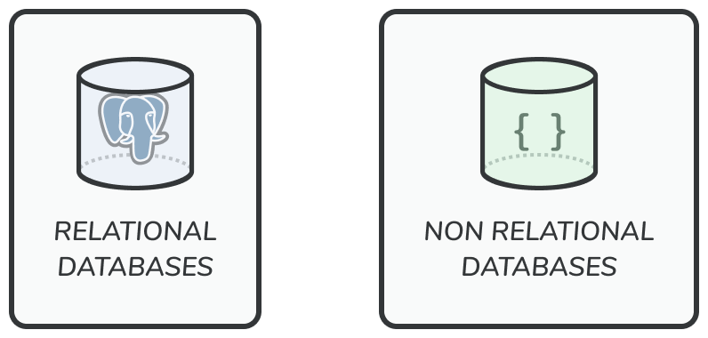

With the growth of users, one server is not enough, and we need multiple servers.

1. One for web/mobile traffic
2. One for Database

So that they can scale independently.

Databases are of two types

1. Relational Databases
2. Non Relational Databases

| Relational Databases                | Non Relational Databases    |
|-------------------------------------|-----------------------------|
| SQL Databases                       | NO SQL Databases            |
| Can be used when data is structured | When Data is non Structured |

No SQL can grouped into four categories

1. Key Value Stores (Redis)
2. Graph Stores (Neo4j)
3. Column Stores (Cassandra)
4. Document Stores (S3)

### Non-Relational Databases might be the right choice if:

1. Your application needs super low latency.
2. Your data is unstructured, or you do not have any relational data.
3. You only need to serialise and deserialize data (JSON, XML, YAML, etc).
4. You need to store massive amount of data.

🧀