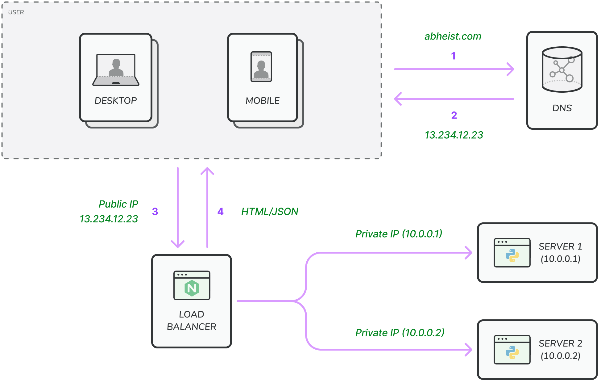

If many users access the server simultaneously, the server reaches the web server load limit, and users will experience
a slower response or fail to connect to the server. A load balancer is the best technique to address these situations.

A load balancer evenly distributes incoming traffic among web servers defined in a load-balanced set.

User Connects to public IP of load balancer directly. Load balancer communicate with web servers with private IPs.
Private IP and servers are not directly accessible to public for better security. Private IPs are only used for
communication between servers on same network.

After adding load balancer, we solved the fail-over issue of the server. If one server is down, other will handles the
requests and if two servers are unable to handle enough traffic, we can add more servers to the web server pool and load
balancer automatically starts sending the request to new server as well.

🥦