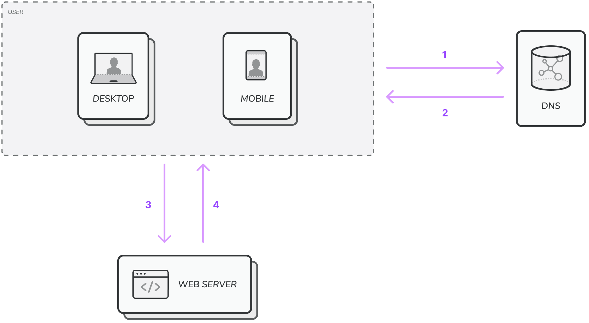

To start with a single server.

Here, request flow is:

1. When user types in URL and hit enter, request goes to DNS server with URL.
2. DNS server provide the IP address of that URL.
3. Once browser gets IP address, it hits the IP address, now the request goes to server on that IP address.
4. Server analyzes the request and accordingly send back the response.

> **DNS** is a paid service provided by third parties and do not host on our servers.
>

🍒