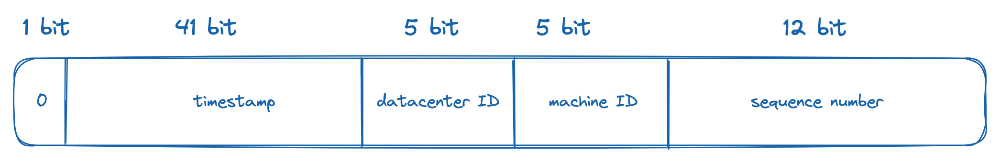

In modern software architecture, distributed systems have become increasingly popular due to their ability to scale horizontally and handle large amounts of data. In these systems, it is essential to create unique identifiers to avoid conflicts between nodes. One of the most popular algorithms used to generate unique IDs is Twitter Snowflake. In this blog post, we will explore how Snowflake works and its benefits.

## How Snowflake Works

Snowflake is a 64-bit unique ID generator. It consists of three main components:

1. Timestamp: 41 bits
2. Node ID: 10 bits
   1. Datacenter ID: 5 bits
   2. Machine ID: 5 bits
3. Sequence number: 12 bits

The timestamp component represents the number of milliseconds that have elapsed since a custom epoch. This component is essential to ensure the uniqueness of the generated ID. 
The node ID component is used to identify the node generating the ID and can be configured based on the number of nodes in the system. 
Finally, the sequence number component is used to differentiate IDs generated in the same millisecond by the same node, and it gets reset every millisecond. This is important because, without it, there would be a risk of generating duplicate IDs.

## Benefits of Snowflake

One of the main benefits of Snowflake is its ability to generate unique IDs at a high rate. It can generate up to 4096 IDs per millisecond. Since Snowflake only requires a single node to generate IDs, it can be easily scaled horizontally to handle increased load. Additionally, the timestamp component of Snowflake IDs allows for easy sorting, which can be useful in analytics or other applications where sorting is necessary.

Another benefit of Snowflake is its simplicity. The algorithm is relatively easy to implement and doesn't require any external dependencies. This makes it an attractive option for developers who need a simple and reliable method for generating unique IDs in their distributed systems.

## UUID

Another option is UUID, which stands for Universally Unique Identifier. It is another algorithm used for generating unique IDs that are safe for distributed systems. UUIDs are randomly generated 128-bit numbers that are practically unique, meaning the probability of generating a duplicate UUID is extremely low. They are not guaranteed to be totally unique, but the probability of a collision is negligible.

According to Wikipedia, "After generating 1 billion UUIDs every second for approximately 100 years, the probability of creating a single duplicate would reach 50%".

One of the main benefits of UUIDs is that they do not require a centralized node to generate IDs, making them ideal for decentralized systems. However, their 128-bit length can make them less efficient than Snowflake in some scenarios that require smaller ID lengths.

Overall, both Snowflake and UUID are reliable options for generating unique IDs in distributed systems, and the choice between them ultimately depends on the specific requirements of the system.

❄️
