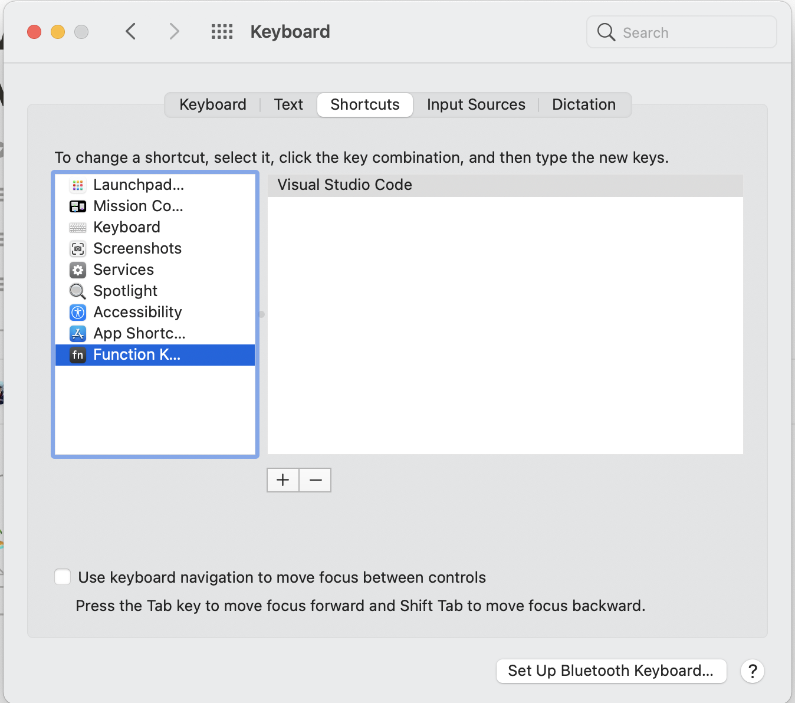

VS Code have tons of shortcuts and some of them include the function keys. But in MacBook with touch bar, it have some shortcuts and make it bit difficult to use function key while being productive. One has to press the `fn` and then get the access to function key.

Yes, there is easy way to show function key in touch bar.

Open `system preference` → `keyboard`. Then select the `shortcut` tab. On left, select `Function Keys` and then click the  `+` plus sign. This will open the Applications folder. Select VS Code. And that is it

It looks nice now. Though, I like the MacBook touch bar, it's just it is a hurdle to use it when developing something.

🦋
